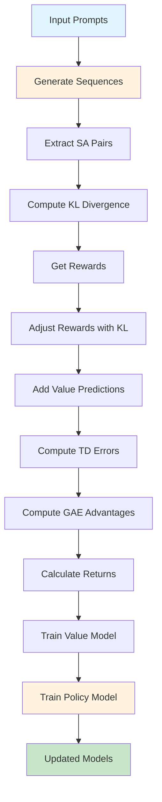
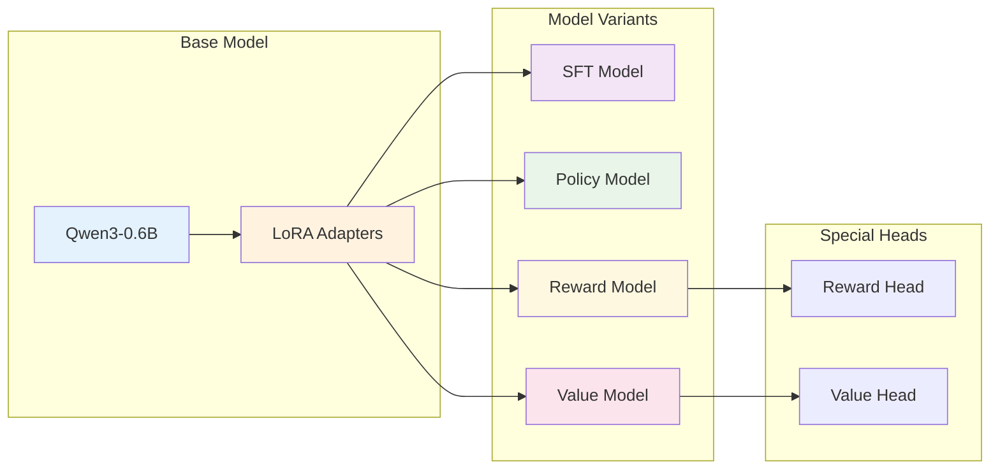
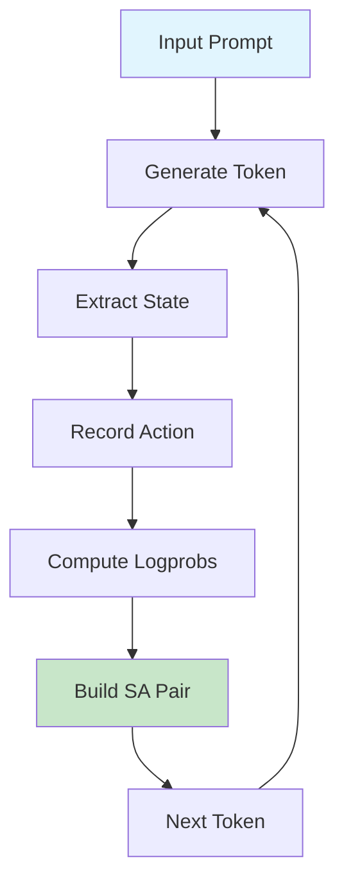
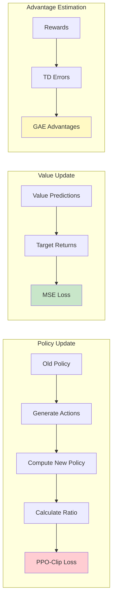

# PPO Implementation for Language Models

A modular implementation of Proximal Policy Optimization (PPO) for language model fine-tuning, built with PyTorch and Transformers.

## 🏗️ Architecture Overview

```
┌─────────────────────────────────────────────────────────────────┐
│                        PPO Implementation                      │
├─────────────────────────────────────────────────────────────────┤
│                                                                 │
│  ┌─────────────┐    ┌─────────────┐    ┌─────────────┐        │
│  │   Config    │    │ Base Setup  │    │   Models    │        │
│  │             │    │             │    │             │        │
│  │ • PPOConfig │    │ • Tokenizer │    │ • SFT Model │        │
│  │ • Hyperparams│   │ • LoRA Setup│    │ • Policy    │        │
│  │ • Training  │    │ • Model Base│    │ • Reward    │        │
│  │   Settings  │    │             │    │ • Value     │        │
│  └─────────────┘    └─────────────┘    └─────────────┘        │
│                                                                 │
│  ┌─────────────┐    ┌─────────────┐    ┌─────────────┐        │
│  │   Token     │    │  Reward/KL  │    │  Advantage  │        │
│  │Attribution  │    │             │    │             │        │
│  │             │    │ • KL Div    │    │ • TD Error  │        │
│  │ • Extractor │    │ • Reward    │    │ • GAE       │        │
│  │ • SA Builder│    │   Adjuster  │    │ • Returns   │        │
│  └─────────────┘    └─────────────┘    └─────────────┘        │
│                                                                 │
│  ┌─────────────┐    ┌─────────────┐    ┌─────────────┐        │
│  │ Experience  │    │  Training   │    │ PPO Trainer │        │
│  │   Buffer    │    │             │    │             │        │
│  │             │    │ • Policy    │    │ • Generator │        │
│  │ • Storage   │    │   Ratio     │    │ • Reward    │        │
│  │ • Batching  │    │ • Losses    │    │   Computer  │        │
│  └─────────────┘    └─────────────┘    └─────────────┘        │
│                                                                 │
└─────────────────────────────────────────────────────────────────┘
```

## 🔄 PPO Training Flow



## 📁 Project Structure

```
ppo_implementation/
├── config/
│   ├── __init__.py
│   └── ppo_config.py          # PPO configuration and hyperparameters
├── base_setup/
│   ├── __init__.py
│   ├── base_setup.py          # Main setup orchestrator
│   ├── tokenizer_setup.py     # Tokenizer initialization
│   ├── lora_setup.py          # LoRA configuration
│   └── model_setup.py         # Base model setup
├── models/
│   ├── __init__.py
│   ├── base_model.py          # Base model class
│   ├── sft_model.py           # Supervised Fine-Tuned model
│   ├── policy_model.py        # Policy model (being trained)
│   ├── reward_model.py        # Reward model
│   └── value_model.py         # Value function model
├── token_attribution/
│   ├── __init__.py
│   ├── token_attribution.py   # Main token attribution
│   ├── extractor.py           # Token extraction
│   └── sa_pair_builder.py     # State-action pair builder
├── reward_kl/
│   ├── __init__.py
│   ├── kl_divergence.py       # KL divergence computation
│   └── reward_adjuster.py     # Reward adjustment with KL penalty
├── advantage/
│   ├── __init__.py
│   ├── td_error.py            # Temporal difference errors
│   ├── gae_advantage.py       # Generalized Advantage Estimation
│   └── return_calculator.py   # Return (reward-to-go) computation
├── experience_buffer/
│   ├── __init__.py
│   └── buffer.py              # Experience replay buffer
├── training/
│   ├── __init__.py
│   ├── policy_ratio.py        # Policy ratio computation
│   ├── policy_loss.py         # PPO-clip loss
│   └── value_loss.py          # Value function MSE loss
├── ppo_trainer/
│   ├── __init__.py
│   ├── ppo_trainer.py         # Main PPO trainer
│   ├── generator.py           # Sequence generation
│   ├── reward_computer.py     # Reward computation
│   ├── value_adder.py         # Value prediction addition
│   └── model_trainer.py       # Model training logic
├── main.py                    # Example usage
└── requirements.txt           # Dependencies
```

## 🧠 Component Details

### 1. Models Architecture



### 2. Token Attribution Process



### 3. PPO Training Components



## 🚀 Quick Start

### Installation

```bash
# Clone the repository
git clone <repository-url>
cd MLX-Week5-PPO

# Install dependencies
pip install -r requirements.txt
```

### Basic Usage

```python
from config import PPOConfig
from ppo_trainer import PPOTrainer

# Initialize configuration
config = PPOConfig()

# Create trainer
trainer = PPOTrainer(config)

# Example prompts
prompts = [
    "SUBREDDIT: r/relationships\nTITLE: Should I admit to snooping?\nPOST: ...\nTL;DR:",
    "SUBREDDIT: r/advice\nTITLE: Need help with decision\nPOST: ...\nTL;DR:"
]

# Run PPO step
results = trainer.ppo_step(prompts)

print(f"Generated texts: {results['generated_texts']}")
print(f"Rewards: {results['rewards']}")
print(f"Value loss: {results['value_loss']:.4f}")
print(f"Policy loss: {results['policy_loss']:.4f}")
```

## ⚙️ Configuration

The `PPOConfig` class contains all hyperparameters:

```python
@dataclass
class PPOConfig:
    # Model configs
    model_name: str = "Qwen/Qwen3-0.6B-Base"
    lora_r: int = 16
    lora_alpha: int = 32
    lora_dropout: float = 0.1
    
    # Training configs
    learning_rate: float = 1e-5
    value_learning_rate: float = 1e-4
    batch_size: int = 32
    max_new_tokens: int = 10
    gamma: float = 0.99
    lam: float = 0.95
    kl_coef: float = 0.1
    clip_epsilon: float = 0.2
    
    # Generation configs
    temperature: float = 1.0
    top_k: int = 50
    top_p: float = 0.95
```

## 🔧 Key Components Explained

### 1. **Token Attribution**
- Divides generated sequences into (state, action) pairs
- Each token becomes an action, with previous tokens as state
- Enables token-level policy optimization

### 2. **KL Divergence Control**
- Prevents policy from deviating too far from reference model
- Uses KL penalty: `adjusted_reward = reward - β × KL`
- Maintains generation quality during training

### 3. **Generalized Advantage Estimation (GAE)**
- Computes advantages using TD errors and discounting
- Balances bias and variance in advantage estimation
- Uses parameters γ (discount) and λ (GAE parameter)

### 4. **PPO-Clip Loss**
- Clips policy ratio to prevent large updates
- `L = min(ratio × advantage, clip(ratio, 1-ε, 1+ε) × advantage)`
- Ensures stable policy updates

## 📊 Training Metrics

The implementation tracks several key metrics:

- **Value Loss**: MSE between predicted and target values
- **Policy Loss**: PPO-clip loss for policy updates
- **KL Divergence**: Distance from reference model
- **Advantages**: GAE-computed advantages for each token
- **Rewards**: Sequence-level rewards from reward model

## 🎯 Use Cases

This PPO implementation is designed for:

1. **Text Generation Fine-tuning**: Improve generation quality
2. **Summarization**: Train models to generate better summaries
3. **Dialogue Systems**: Optimize conversational responses
4. **Code Generation**: Improve code generation capabilities
5. **Creative Writing**: Enhance creative text generation

## 🔬 Extending the Implementation

### Adding New Components

1. **New Models**: Extend `BaseModel` class
2. **Custom Rewards**: Modify `RewardComputer`
3. **Different Advantages**: Implement new advantage estimators
4. **Alternative Losses**: Add new loss functions in `training/`

### Example: Custom Reward Model

```python
class CustomRewardModel(RewardModel):
    def forward(self, input_ids, attention_mask):
        # Custom reward computation
        base_reward = super().forward(input_ids, attention_mask)
        custom_penalty = self.compute_custom_penalty(input_ids)
        return base_reward - custom_penalty
```

## 🤝 Contributing

1. Fork the repository
2. Create a feature branch
3. Add tests for new functionality
4. Ensure all tests pass
5. Submit a pull request

## 📄 License

This project is licensed under the MIT License - see the LICENSE file for details.

## 🙏 Acknowledgments

- Based on the PPO algorithm from "Proximal Policy Optimization Algorithms"
- Uses Hugging Face Transformers and PEFT for efficient fine-tuning
- Inspired by modern RLHF implementations

---

**Note**: This implementation is for educational and research purposes. For production use, consider additional safety measures and evaluation protocols.
